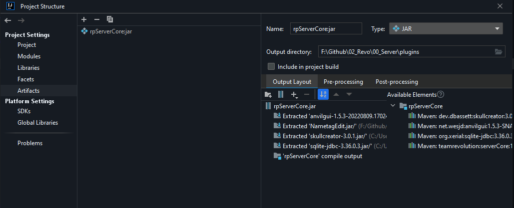
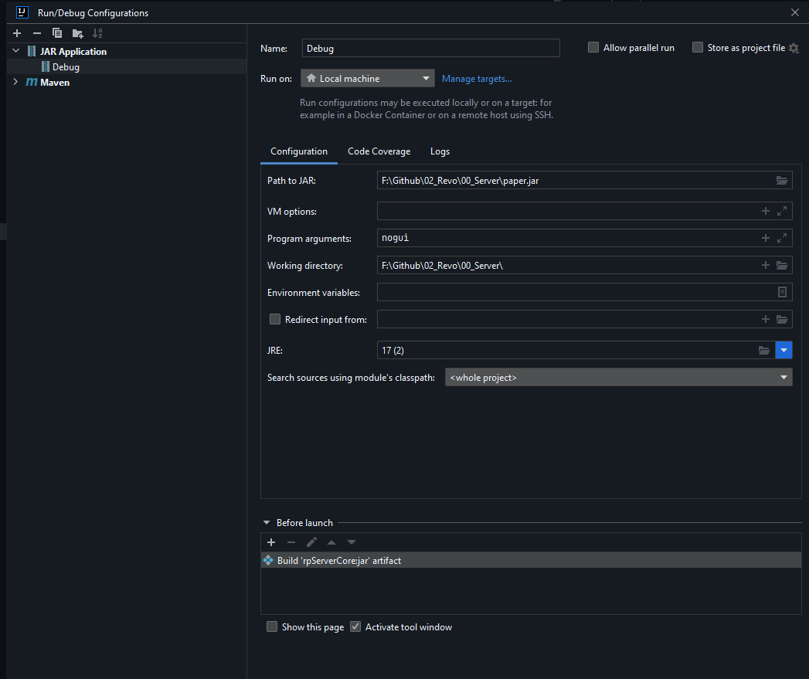
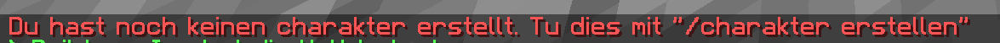
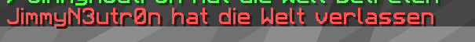
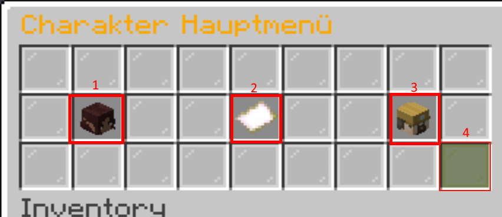
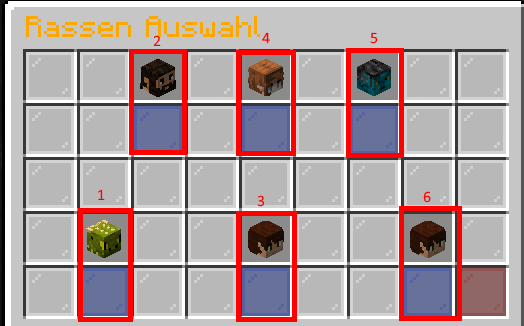
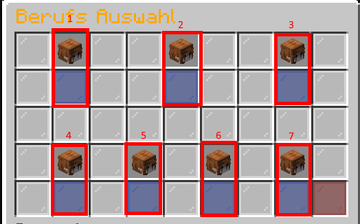

# Dev Wiki

- [Dev Wiki](#dev-wiki)
  - [Arbeiten](#arbeiten)
    - [Debug mit IntelliJ](#debug-mit-intellij)
    - [Workflow](#workflow)
      - [Deploy mit Maven](#deploy-mit-maven)
  - [Plugins](#plugins)
    - [Revo Farming](#revo-farming)
    - [Revo Chat](#revo-chat)
      - [Channel](#channel)
      - [Emotes](#emotes)
    - [Revo Core](#revo-core)
    - [Dependencies](#dependencies)
      - [PlayerJoin](#playerjoin)
      - [PlayerLeave](#playerleave)
      - [Commands](#commands)
        - [CustomItem](#customitem)
        - [Debug](#debug)
        - [Charakter](#charakter)
          - [Erstellen](#erstellen)
          - [Ändern](#ändern)
          - [Löschen](#löschen)

----

Dieses Dokument / diese Dokumente beschreiben den aktuellen zustand der Plugin Entwicklung und Dokumentiert ein wenig das technische Grundgerüst, welches teilweise hinter den Plugins und deren Features steckt.

## Arbeiten

### Debug mit IntelliJ

- Artifact bauen einstellen. (Hinzufügen, Jar with dependencies)



- Neue Configuration. (Neue Jar, Path to jar = Path to server Jar, Working Dir= server Dir, Before Launch: Build artifact)



### Workflow

#### Deploy mit Maven

Aktuell ist noch kein CI-Job feature im "ready to use" stand. Der Manuelle Deploy funktioniert aber problemlos. Braucht jedoch noch einige Voreinstellungen.

Im Ordner ".m2" befindet sich eine "settings.xml". In dieser muss folgende Einstellung hinzugefügt werden.

[GitLab Doku](https://docs.gitlab.com/ee/user/packages/maven_repository/index.html#create-maven-packages-with-gitlab-cicd)

```xml
    <server>
      <id>revo-gitlab</id>
      <configuration>
        <httpHeaders>
          <property>
            <name>Private-Token</name>  # Der name muss "Private-Token" sein
            <value><ACCESS-TOKEN></value>  # Schaue hier für Anleitung wie du zum Access token kommst: https://docs.gitlab.com/ee/user/profile/personal_access_tokens.html
          </property>
        </httpHeaders>
      </configuration>
    </server>
  </servers>
```

Dann muss innerhalb des Projekts noch die "pom.xml" angepasst werden.

```xml
  <repository>
      <id>revo-gitlab</id>
      <url>https://gitlab.team-revolution.net/api/v4/projects/<PROJECT-ID>/packages/maven</url> # Die Project-Id ist die Id des Repos in GitLab
  </repository>

  <distributionManagement>
    <repository>
        <id>revo-gitlab</id>
        <url>https://gitlab.team-revolution.net/api/v4/projects/<PROJECT-ID>/packages/maven</url>
    </repository>
  </distributionManagement>
```

Beim Importieren eines Projektes ist der Bereich "distributionManagement" nicht allzu wichtig. Dieser wird nur zum Deployen gebraucht. Jedoch muss das Repository gesetzt sein.
Dazu kommt, dass das Projekt als Dependency hinzugefügt werden. Beispielhaft geht das so

```xml
<dependency>
  <groupId>revotest</groupId>
  <artifactId>revotest</artifactId>
  <version>1.0-SNAPSHOT</version>
</dependency>
```

Die Werte müssen dann je nach werte Projekt angepasst werden. Schau dazu im zweifel in das "Package Registry" in GitLab um die genauen Werte zu bekommen.

## Plugins

### [Revo Farming](https://gitlab.team-revolution.net/rp-server/farming)

Sorgt für die Farming spots das die so funktionieren wie es gewünscht ist.

Es überprüft ob der Spieler in einem Farmgebiet ist(Noch nicht implementiert) falls ja. Ersetzt das Plugin abgebaute Erze mit Cobblestone / Bedrock und setzt sie mit einer Zufallschance wieder neu.
Das Vorkommen der Erze ist von der Höhe abhängig.

### [Revo Chat](https://gitlab.team-revolution.net/rp-server/RevoChat)

Regelt den Chat und managed die Reichweiten sowie Support Leistungen

#### Channel

Alle Channel sind mit /channel "NAME" sowie /"NAME" wechselbar
standart ist der Globalchat

- channel global
  - Global
  - Intern: chatOOC

- channel support
  - Global
  - Ermöglicht Teammitgliedern sich direkt zu dem Spieler zu teleportieren
  - Intern: chatSupport

- channel flüstern
  - 3 Blöcke
  - Intern: chatFlüstern

- channel reden
  - 10 Blöcke
  - Intern: chatReden

- channel rufen
  - 25 Blöcke
  - Intern: chatRufen

- channel schreien
  - 75 Blöcke
  - Intern: chatSchreien

#### Emotes

Mit "~" kann man Emotes wie "Builders_Inc schreibt dies" erstellen

### [Revo Core](https://gitlab.team-revolution.net/rp-server/rpServerCore)

Steuert die generelle Struktur des Servers. Dazu zählt die Economy, die Charakterwerte und die generelle IO

### Dependencies

Bibliotheken die intern benutzt werden (Müssen nicht extra installiert werden nur als dependency hinzugefügt werden)

- [SkullCreator](https://github.com/deanveloper/SkullCreator) für das erstellen von Custom köpfen
- [AnvilGui](https://github.com/WesJD/AnvilGUI) für das erstellen von Anvil GUIs

#### PlayerJoin

Betritt ein Spieler die Welt wir überprüft ob ein Charakter auf den Spieler registriert ist und gibt eine Nachricht aus falls dies nicht der fall ist.


Ausserdem wird eine eigene Nachricht als Join Nachricht gesendet.


#### PlayerLeave

Es wird eine eigene Leave Nachricht gesendet



#### Commands

##### CustomItem

Gibt eine Gui aus der man sich alle Custom items nehmen kann die es aktuell gibt.

##### Debug

Ein Befehl mit dem man die aktuelle werte und zustände eines Spielers zu bekommen. Der Spieler muss dazu angegeben werden.

##### Charakter

###### Erstellen

CustomID bezieht sich auf einen Persistent datacontainer.
diese wird hier benutzt um die Items zu auseinander zu halten und hat den Namen **charGuiId**

Nur möglich wenn KEIN char vorhanden ist

Main Gui
<!-- TODO Bilder updaten -->
<!-- TODO IDs updaten -->


|Nummer |Aussehen     |Funktion      |CustomID    |
|---  |---            |---           |---         |
|1    |[Text](www.google.de)         |Auswahl Rasse  |110        |
|2    |tbd            |Auswahl Name  |111        |
|3    |tbd            |Auswahl job    |112        |
|4    |tbd            |Bestätigen     |113        |

Rassenauswahl



[Spielbare Rassen](https://docs.google.com/document/d/1yzjh8mXuGqiS7lcHNbqu8a4_eEi4m6oaij90N2uQ5Ig/edit)

|Nummer |Aussehen   |Funktion         |CustomID   |
|---    |---        |---              |---        |
|1      |tbd        |Auswahl Ederki   |117        |
|2      |tbd        |Auswahl Monthos  |118        |
|3      |tbd        |Auswahl Tipas    |119        |
|4      |tbd        |Auswahl Avari    |117        |
|5      |tbd        |Auswahl Lumia    |118        |
|6      |tbd        |Auswahl Gamta    |119        |

Jobauswahl



[Berufe liste](https://docs.google.com/document/d/1YLqxBJjmGlqHlMhHuHeZSUj3MarBHgdxsdb1B_NnZG8/edit)

|Nummer |Aussehen       |Funktion               |CustomID   |
|---    |---            |---                    |---        |
|1      |tbd      |Auswahl Waffenschmied  |120        |
|2      |tbd      |Auswahl Rüstungsschmied|120        |
|3      |tbd      |Auswahl Koch           |120        |
|4      |tbd      |Auswahl Tischler       |120        |
|5      |tbd      |Auswahl Steinmetz      |120        |
|6      |tbd      |Auswahl Gelehrter      |120        |
|7      |tbd      |Auswahl Alchemist      |120        |

Für beide Sachen. Die Blauen Glasscheiben öffnen einen Link zur Vorstellung der Rasse / des Berufes

###### Ändern

Selbe Guis wie bei erstellen. Nur möglich wenn ein Char vorhanden ist

###### Löschen

Gibt eine Gui mit der man seinen Char löschen kann. Um sicher zu sein muss der Spieler seinen Namen nochmal eingeben.

Als Admin hat man die Möglichkeit mit /Charakter löschen force MINECRAFTNAME den Char zu löschen. Der Spieler muss online sein.
